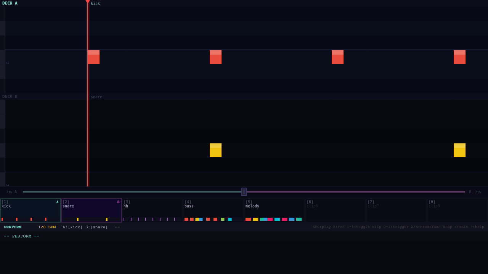

# Trig Seq: initial build

_2026-03-27_

## What happened

Started a new MIDI sequencer project from scratch with a core idea I've been sitting on: what if the playhead didn't move, and the clip scrolled under it instead — like a record under a needle? That inversion unlocks a whole DJ-deck mental model where you stand at the mixer and the music comes to you rather than chasing a timeline. The initial build has two independent decks, each capable of layering multiple clips simultaneously on a shared piano roll grid (so kick on row 36, snare on row 38, melody on rows 60–72 all coexist and are visually readable), plus a crossfader between them. The whole thing is keyboard-driven in a Vim-style modal setup — no mouse needed, which matters because you can't reliably click a target that's always moving.

## Files touched

  - .claude/commands/devsnap.md
  - .project.toml
  - devlog/assets/.gitkeep
  - scripts/devlog-preview.sh
  - scripts/devpublish.sh
  - scripts/devsnap.sh
  - scripts/install-hooks.sh

## Tweet draft

Built a MIDI sequencer where the playhead stays fixed and the clip scrolls under it — like a turntable needle. Two decks, a crossfader, clip layering on a shared piano roll grid. Keyboard-only, no mouse. It's a DJ mixer for MIDI patterns. [link]

---

_commit: c0d15e7 · screenshot: captured_
